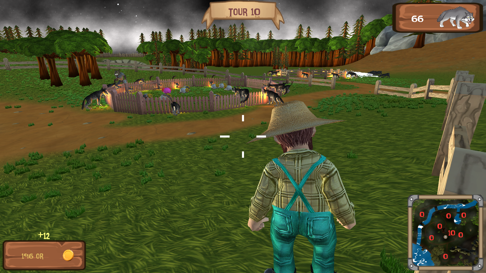

# Jeu Du Berger - Tower Defense Game
Un berger doit défendre ses enclos contre les loups chaque nuit à l’aide de son arme et de pièges posés le jour.

## Features développé intégralement par moi même 
- Statistiques Joueurs : 
	- Gestion des dégats
	- Animations
	- Gestions mort
  - Sons
  - Interaction avec les autres entités comme les loups via son arme
- IA des Loups:
  - Fonctionnalités communes à tous les loups : 
    - Algorithme d'attribution de cible, chaque enclos est ocmposé de barrière afin de donner un bon rendu, les loups au corps à corps 
    vont essayer de se répartir au mieux autour de l'enclos tandis que les loups à distance vont s'approprier la barrière la plus
    proche de leur cercle de rangeIn.
    - Une fois que le joueur les a attaqués, les loups se mettent à le pourchasser jusqu'à leur mort ou la leur. Attention la condition de défaite n'est pas la mort du berger, qui peut respawn , mais de ses moutons
    - Chaque type de loups a une petite lanterne pour mieux le repérer dans la nuit selon son type et ainsi agir en conséquence.
    - Les loups communiquent entre eux de manière virtuelle en s'abonant à la même cible , lorsque leur cible est morte tous les loups
    sont prévenus et cherchent une nouvelle cible en conséquence
  - Fonctionnalités communes aux loups range (Aquatique / Montagne) :
    - Ils disposent de deux cercles , un plus petit pour détecter lorsque leur cilbe est assez proche pour la considérer en range
    , un autre pour leur dire quand leur cible est trop loin et elle devient out of range. L'idée était d'éviter à ce que les loups
    changent continument d'état quitte à ce que leur portée maximale ne soit pas la même portée qui considère si oui ou non leur 
    cible est en range. Une fois le mode attaque ils se tourneront vers leur cible.
  - Loups des montagnes
    - Il peut geler le joueur s'il l'attaque de manière continue pendant un certain temps, plus d'explications par la suite.
  - Loups bosse
    - Si le joueur est en vie, le loups bosse le prendra en chasse. Si le joueur est mort, le temps que le joueur respawn , le bosse attaquera alors les enlos, mais lorsque le joeur sera de nouveau en vie il sera prévenu du respawn du joueur.
- Freezing System : 
  - Lorsque les loups de montagnes attaquent le joueur, si le joueur subit du gel pendant un certain temps il se gèle pendant quelques secondes.
  - Ensuite, le joueur ne peut plus être gelé pendant un certain temps
  - Le joueur peut également éviter le gel et remettre à 0 le compteur s'il arrive à éviter les attaques des loups des montagnes
- Pièges
  - Lapins aussi apellé Bait : Attire les loups sur lui si les loups sont assez proche, cela permet d'attirer les loups dans les pièges étant donné
  que le monde est assez ouvert
- UI
  - Aide au déclenchement des pannels de tutoriel pour guider le joueur
  - Barre de vie des loups qui s'affichent uniquement un petit laps de temps lorsqu'ils subissent des dégats
- Spawn Loups
  - Correction de certains bugs et amélioration du script et des spawn position
## Comment jouer ?

Clôner le projet et deziper JeuDuBerger.zip qui se trouve dans Build
 
## Controles
La plupart des mécaniques sont expliquées dans le jeu grâce à des tutoriels qui se déclenchent de manière intelligente
- Pour poser des pièges il faut appuyer sur 1,2,3,4 situer au-dessus des lettres du clavier
- On peut améliorer un piège ou le revendre (clique gauche/clique droit)
- Pour ajouter des moutons dans un enclos  il faut se diriger proche d'un enclos et appuyer sur + pour ajouter - pour enlever
et * pour le super mouton qui rendra invulnérable votre enclos pendant une nuit.
## Conclusion
Aboutissement d'un vrai projet, jeu selon mon point de vue quasiment livrable, il manquerait peut-être d'équilibrage mais
c'est un jeu qui demande au joueur de la réflexion et du skill donc assez dur tout de même. Bilan : Très statisfait de ce jeu.

## Authors

* **Sacha Vanleene - Developper** 
* **Edouard François - Developper**
* **Arnaud Monteils - Developper**
* **Esmé James - Developper**
* **Théo Debay - Developper**
* **Wilfried Pouchous - Developper**
* **Hugo Brunet - Developper**
